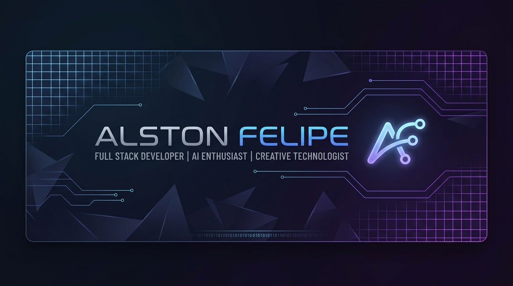

  

<h1 align="center">👋 Olá, eu sou o Alston Felipe</h1>

  <b>Engenheiro de Software | Entusiasta de IA | Desenvolvedor Full Stack</b>

---

### 🚀 Sobre mim

- 🔭 Atualmente trabalhando em projetos de desenvolvimento **Full Stack** , **Inteligência Artificial** e **N8N** .
- 💼 Apaixonado por transformar ideias complexas em arquiteturas limpas e funcionais.
- 💬 Pode me perguntar sobre **N8N, , Python, TypeScript, JavaScript, React e Node.js**.

---

---
### 🛠️ Tecnologias e Ferramentas

  
  
  
  
  
  
  
  

---

### 📊 Estatísticas do GitHub

  

